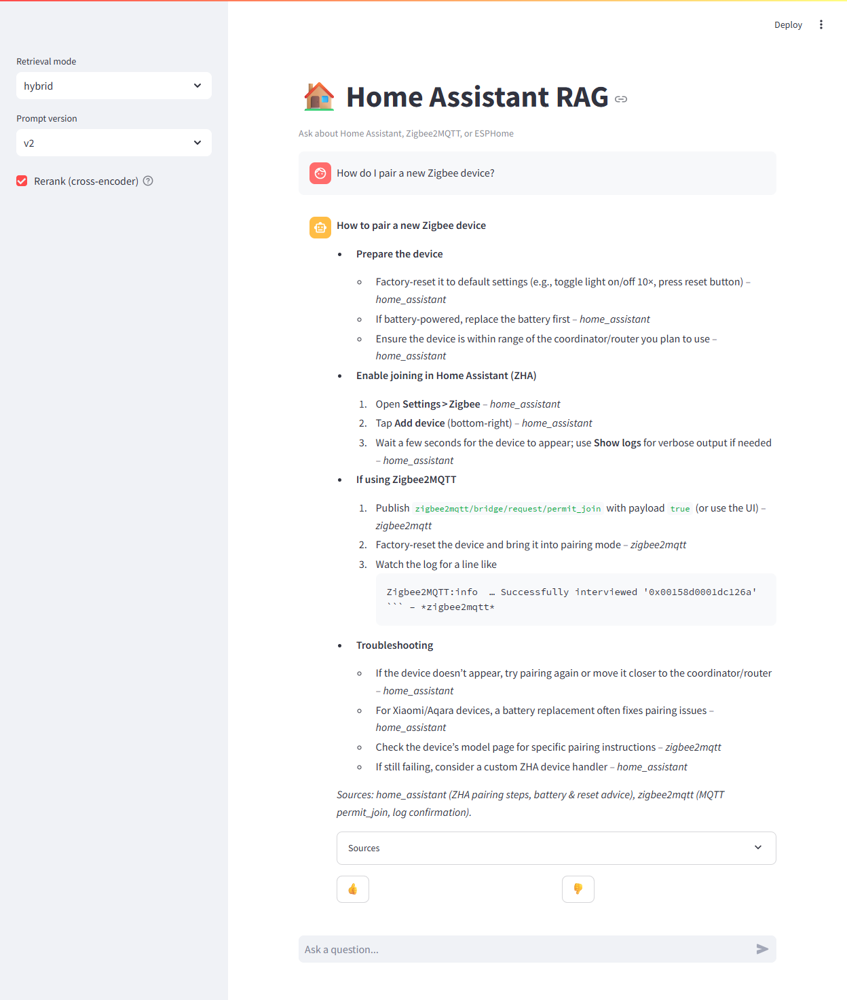
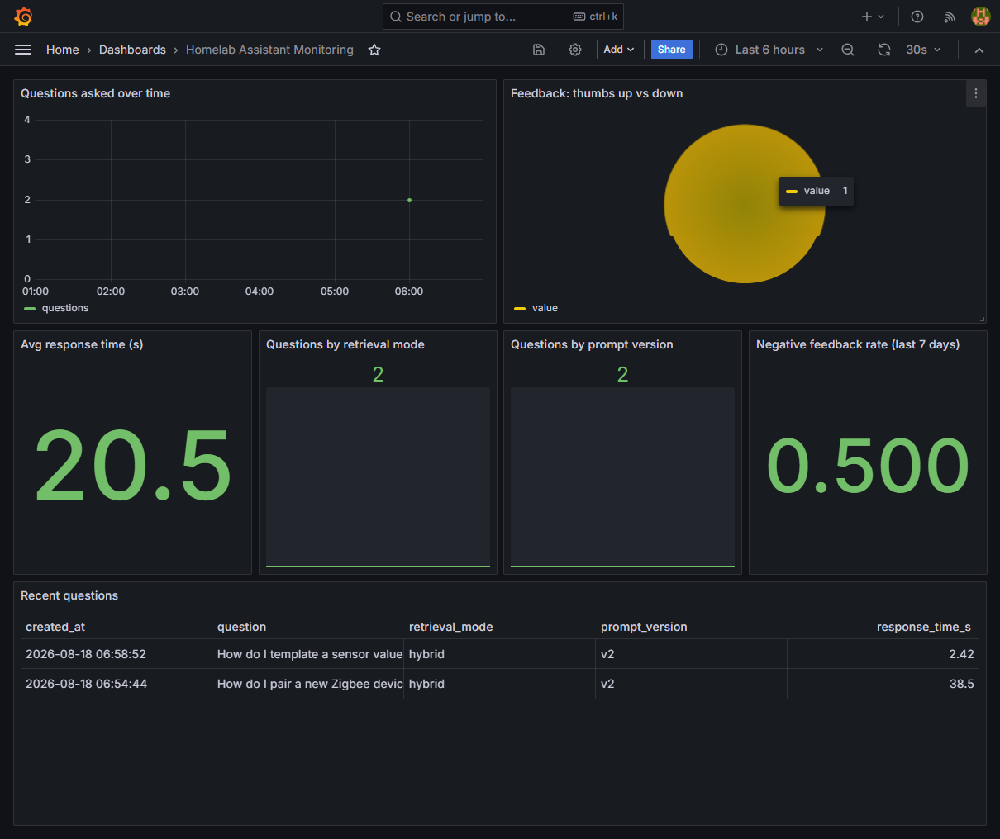

# Home Assistant RAG — Q&A for Home Assistant / Zigbee2MQTT / ESPHome

> LLM Zoomcamp 2026 Capstone Project

## Problem description

People setting up a smart home with Home Assistant, Zigbee2MQTT, and ESPHome run into
scattered, version-specific documentation across three separate projects. Answers are
technically correct but hard to find quickly, especially for troubleshooting questions
(e.g. "why is my Zigbee device stuck as unavailable", "how do I template a sensor value").

**Home Assistant RAG** is a RAG chatbot that ingests the official docs of these three
projects into a searchable knowledge base and answers natural-language questions with
grounded, cited responses, so a self-hoster doesn't have to grep through three different
doc sites.

- Input: a natural language question about Home Assistant / Zigbee2MQTT / ESPHome
- Output: a grounded answer + the doc chunks it was based on
- Users can thumbs up/down every answer, which feeds a monitoring dashboard

## Dataset

Scraped from public documentation:
- https://www.home-assistant.io/docs/ and /integrations/
- https://www.zigbee2mqtt.io/
- https://esphome.io/

See `ingestion/sources.yaml` for the exact page list. Not the DTC FAQ dataset.

## Architecture / flow

```
docs (web) --> ingestion/ingest.py (scrape, chunk, embed) --> Postgres (pgvector + tsvector)
                                                                      |
Streamlit UI --> FastAPI /ask --> hybrid retrieval (vector + text) --> LLM (Groq) --> answer
                       |
                 /feedback --> Postgres --> Grafana dashboard
```

## Evaluation criteria mapping

| Criterion | Where |
|---|---|
| Problem description | this section |
| Retrieval flow | `app/rag.py` (knowledge base + LLM) |
| Retrieval evaluation | `eval/evaluate_retrieval.py` — compares vector-only, text-only, hybrid |
| LLM evaluation | `eval/evaluate_llm.py` — compares 2 prompt versions w/ LLM-as-judge |
| Interface | FastAPI (`app/main.py`) + Streamlit (`app/streamlit_app.py`) |
| Ingestion pipeline | `ingestion/ingest.py`, automated via `dlt` |
| Monitoring | feedback collection + Grafana dashboard (`monitoring/`), 5+ charts |
| Containerization | `docker-compose.yml` — everything included |
| Reproducibility | see Setup below, pinned versions in `requirements.txt` |
| Best practices | hybrid search (evaluated), query rewriting (demoed), reranking (evaluated) |

## Setup

```bash
cp .env.example .env      # fill in GROQ_API_KEY
docker compose up -d --build
docker compose exec app python ingestion/ingest.py
```

- App (Streamlit): http://localhost:8501
- API (FastAPI docs): http://localhost:8000/docs
- Grafana: http://localhost:3000 (admin/admin)

## Running evaluation

```bash
python eval/generate_golden_set.py     # LLM-generates Q&A pairs from chunks
python eval/evaluate_retrieval.py      # hit-rate/MRR for vector vs text vs hybrid
python eval/evaluate_llm.py            # prompt v1 vs v2, LLM-as-judge
```

## Evaluation results

### Dataset

677 chunks ingested from the three doc sources: 463 Home Assistant, 145 ESPHome,
69 Zigbee2MQTT (see `ingestion/sources.yaml` for the page list).

Golden set: 120 LLM-generated Q&A pairs (2 questions per sampled chunk, 60 chunks
sampled) used for retrieval evaluation, with a 25-question subset used for LLM
evaluation (see `eval/generate_golden_set.py`).

### Retrieval evaluation

Compared three retrieval strategies (Top-5) — `eval/evaluate_retrieval.py`:

| Mode | Hit Rate@5 | MRR@5 | n |
|---|---|---|---|
| Vector-only | 0.767 | 0.569 | 120 |
| Text-only (BM25-style) | 0.367 | 0.342 | 120 |
| **Hybrid (RRF, vector + text)** | **0.850** | **0.685** | 120 |

Hybrid search wins on both metrics and is used as the default retrieval mode
(`app/rag.py`), which also covers the "hybrid search" best-practice item.

### LLM evaluation

Compared two prompt versions using an LLM-as-judge (1-5 relevance/groundedness
score) — `eval/evaluate_llm.py`:

| Prompt version | Avg score | n |
|---|---|---|
| v1 (basic) | 4.875 | 24 |
| **v2 (structured, cites source per fact)** | **5.0** | 25 |

v2 is used as the default prompt. Note: scores cluster near the ceiling (5.0),
so the LLM-judge isn't very discriminative on this sample — a limitation worth
flagging rather than treated as a strong signal on its own. One question was
skipped due to a Groq free-tier rate limit (429).

### Query rewriting

Before retrieval, the raw user question is rewritten by the LLM into a clearer,
more search-friendly query (`rewrite_query()` in `app/rag.py`, applied in every
`/ask` call). Example outputs — `eval/demo_query_rewrite.py`:

| Raw question | Rewritten query |
|---|---|
| kok device gua unavailable terus ya | "Kok device saya unavailable terus ya" |
| gimana cara nge-pair-nya? | pair device with smart home system |
| why won't it stay connected | "smart home device connection issues" |
| how do i make it turn on automatically at sunset | "automatically turn on lights at sunset smart home setup" |
| esphome ota not working help | "ESPHome OTA not working" |

For English questions the rewrite meaningfully sharpens the query. For the
Indonesian/slang example, though, the rewrite barely changes anything — it
doesn't translate or standardize it into English, which is what the underlying
docs are written in. Since retrieval runs on English documentation, this is a
real limitation: non-English questions likely retrieve worse than English ones.
A stronger version would explicitly instruct the rewriter to translate to
English, which we haven't evaluated here.

### Reranking

Initial retrieval (hybrid, top-20 candidates) is optionally re-scored by a
local cross-encoder (`Xenova/ms-marco-MiniLM-L-6-v2`, via fastembed, no API
cost) before taking the final top-5. Compared against plain hybrid retrieval
on the same golden set — `eval/evaluate_reranking.py`:

| Variant | Hit Rate@5 | MRR@5 | n |
|---|---|---|---|
| Hybrid (no rerank) | 0.917 | 0.770 | 120 |
| **Hybrid + rerank** | **0.958** | **0.880** | 120 |

Reranking clearly improves ranking quality (MRR 0.77 → 0.88), so it's enabled
by default (`rerank=True` in `/ask`, toggleable in the UI and API). Trade-off:
it adds one extra local model call per question, so latency is slightly
higher — acceptable here since the cross-encoder runs locally and is small
(~90MB).

Note: this golden set was regenerated for this run, so hit-rate/MRR numbers
differ slightly from the retrieval-mode comparison above (fresh random
sample of chunks/questions each time `generate_golden_set.py` runs).

## Screenshots

**Chat UI (Streamlit)** — grounded answer with per-fact source citation and expandable sources list:



**Monitoring dashboard (Grafana)** — question volume, feedback ratio, avg response time, retrieval mode / prompt version breakdown, recent questions table:

